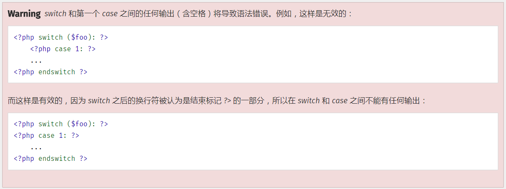

## 流程控制的替代语法
* PHP 提供了一些流程控制的替代语法，包括` if，while，for，foreach` 和 `switch`。替代语法的基本形式是 __把左花括号（`{`）换成冒号（`:`），把右花括号（`}`）__ 分别换成 `endif;，endwhile;，endfor;，endforeach;` 以及 `endswitch;`。

* eg1:
    ```php
    <?php if ($a == 5): ?>
    A is equal to 5
    <?php endif; ?>
    ```

* eg2:
    ```php
    <?php
    if ($a == 5):
        echo "a equals 5";
        echo "...";
    elseif ($a == 6):
        echo "a equals 6";
        echo "!!!";
    else:
        echo "a is neither 5 nor 6";
    endif;
    ```

* Note: 一个坑 
