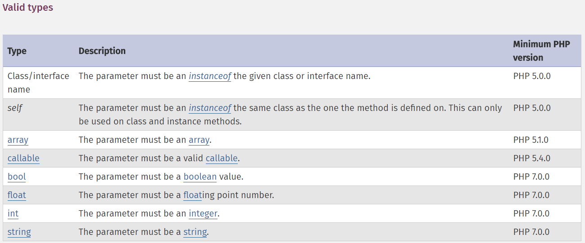

## 函数的参数
* PHP 支持 
    * 按值传递参数（默认）;
    
    * 通过引用传递参数以及默认参数;
    
    * 也支持可变长度参数列表.


### 通过引用传递参数
```php
<?php
function add_some_extra(&$string)
{
    $string .= 'and something extra.';
}

$str = 'This is a string, ';

add_some_extra($str);
// add_some_extra(&$str); // 结果同上

echo $str; // 'This is a string, and something extra.'
```


### 默认参数的值


### (参数) 类型声明
* 类型声明允许函数在调用时要求参数为特定类型。

* 如果给出的值类型不对，那么将会产生一个错误： 
    * 在PHP 5中，这将是一个可恢复的致命错误，而在PHP 7中将会抛出一个 `TypeError` 异常。

* Valid types:
    * 很多类型都是php7开始支持的 

    * 

    * eg:
    ```php
    <?php
    function test(bool $param)
    {}

    test(true);
    ```


### 严格类型
* 在严格模式中，只有一个与类型声明完全相符的变量才会被接受，否则将会抛出一个TypeError。
    * 唯一的一个 _例外_ 是可以将 `integer` 传给一个期望 `float` 的函数。


* `declare(strict_types=1);` 启用严格类型:
    ```php
    <?php
    declare(strict_types=1);

    function sum(int $a, int $b) {
        return $a + $b;
    }

    var_dump(sum(1, 2));
    ```


### 捕获类型错误
    ```php
    <?php
    declare (strict_types = 1);

    function sum(int $a, int $b)
    {
        return $a + $b;
    }

    try {
        var_dump(sum(1, 2));
        var_dump(sum(1.5, 2.5));
    } catch (TypeError $e) {
        echo 'Error: ' . $e->getMessage();
    }
    ```


### 可变数量的参数列表
* 在 PHP 5.6 及以上的版本中，由 __...__ 语法实现

* 在 PHP 5.5 及更早版本中，使用函数 `func_num_args()`，`func_get_arg()`，和 `func_get_args()`

* 使用 `...` 作为变量参数: 参数被当作数组传入函数
    ```php
    <?php
    function sum(...$numbers)
    {
        $acc = 0;
        foreach ($numbers as $n) {
            $acc += $n;
        }
        return $acc;
    }

    echo sum(1, 2, 3, 4); // 10
    ```


* 使用 `...` 作为变量参数: 解构数组
    ```php
    <?php
    function add($a, $b)
    {
        return $a + $b; // 传入的数组被一一解构
    }

    echo add(...[1, 2]) . "\n";

    $a = [1, 2];
    echo add(...$a);
    ```


* 可变参数类型提醒: 类型必须是对象
    * `function total_intervals($unit, DateInterval ...$intervals) { ... }`


* 旧版本处理可变参数:
    ```php
    <?php
    function sum() { // 这里没有任何提醒
        $acc = 0;
        foreach (func_get_args() as $n) {
            $acc += $n;
        }
        return $acc;
    }

    echo sum(1, 2, 3, 4);
    ```
